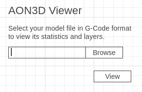
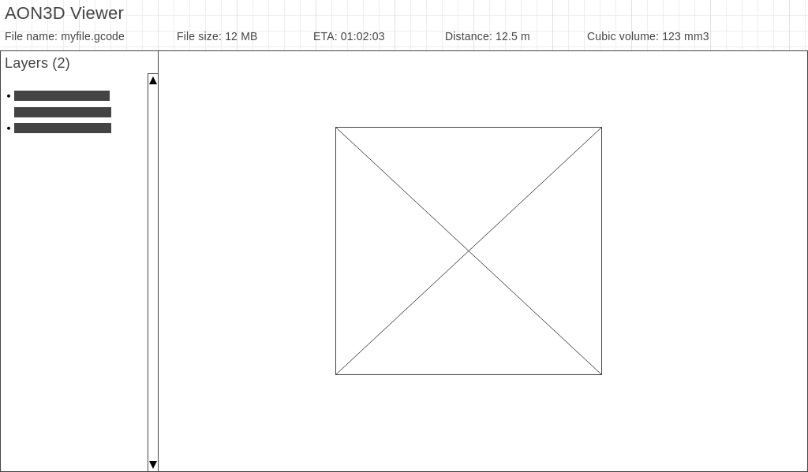
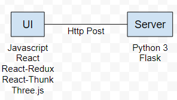

### AON3D Viewer

Author: Juan Argaez - March 23th 2020

#### Requirements

1. A user wants to know statistics about a 3D model before printing it:
    1. File size
    1. Estimated time of printing
    1. Estimated distance travelled by the extruder
    1. Cubic volume
    1. Number of layers
    1. Estimated amount of filament

1. A user wants to view the model layers to be printed.
   Toolpaths should be colored depending on feed rate, as the color scale in https://www.gcodeanalyser.com/.

#### Solution

Users will use a web application to upload a G-Code file through a form, then
view its statistics, metadata and 3D models of layers.

##### Wireframes

###### File upload

* The user selects a G-Code model file and then clicks _View_ to submit it

###### Viewer

After the user submits a model file, the UI shows:
* Statistics about the model on the top
* Layers list with metadata on the left
* Layer models render on the center as the user selects one to view

##### Software architecture blueprint

###### UI

Is the frontend web application which the user interacts with to upload the model file and then view statistics and model layers in WebGL.

###### Server

Is the backend server of the web application which receives a model file and process it to calculate statistics and parse G-Code instructions.

###### Http Post

The server exposes a URL to accept POST requests with a G-Code file. The response is a JSON with the file statistics and layers data.